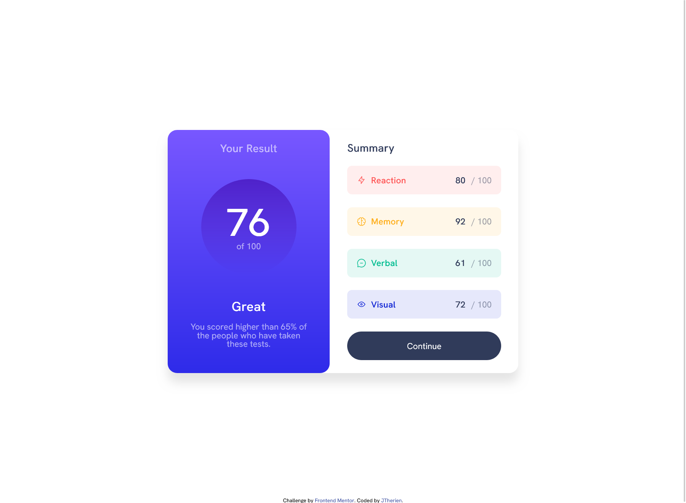
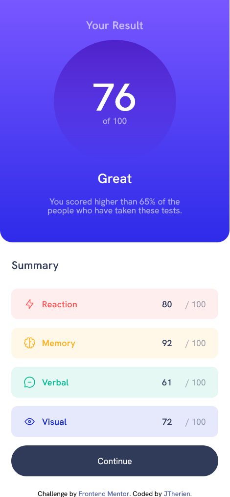

# Frontend Mentor - Results summary component solution

This is a solution to the [Results summary component challenge on Frontend Mentor](https://www.frontendmentor.io/challenges/results-summary-component-CE_K6s0maV). Frontend Mentor challenges help you improve your coding skills by building realistic projects. 

## Table of contents

- [Overview](#overview)
  - [The challenge](#the-challenge)
  - [Screenshot](#screenshot)
  - [Links](#links)
- [My process](#my-process)
  - [Built with](#built-with)
  - [What I learned](#what-i-learned)
  - [Continued development](#continued-development)
  - [Useful resources](#useful-resources)
- [Author](#author)

## Overview

### The challenge

Users should be able to:

- View the optimal layout for the interface depending on their device's screen size
- See hover and focus states for all interactive elements on the page

### Screenshot

### Links

- Live Site URL: [GitHub Pages](https://jtherien.github.io/results-summary-component/)

## My process

### Built with
- Flexbox
- CSS Grid
- JavaScript

### What I learned
I learned quite a bit from this exercise. I learned how to use the fr unit which helped
a ton with sub-dividing the spaces. I also learned about the @media rule which I used to 
help convert the page to a mobile-friendly view. Lastly, I learned how to use JavaScript dynamically
change HTML content.

### Continued development

I feel that my CSS organization has gotten a bit better compared to the first but I think there's still more to do in order to keep
my code clean. I'd like to further my understanding of building a "mobile first" workflow. I also want to build out my JavaScript skills to be able to make more dynamic content.

### Useful resources

- [CSS Tricks: An Introduction to the `fr` CSS unit](https://css-tricks.com/introduction-fr-css-unit/)
- [CSS Tricks: The Shapes of CSS](https://css-tricks.com/the-shapes-of-css/)

## Author

- GitHub - [JTherien](https://github.com/JTherien)
- Frontend Mentor - [@JTherien](https://www.frontendmentor.io/profile/JTherien)